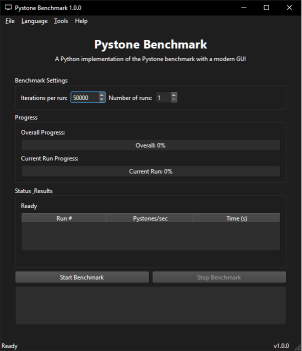

#  Benchmark

[](https://www.gnu.org/licenses/gpl-3.0)
[](https://www.python.org/downloads/)
[](https://github.com/psf/black)

A modern Python benchmarking tool built with PySide6, providing a user-friendly interface for running and analyzing Pystone and other benchmark tests.



## 📥 Installation

### Prerequisites

- Python 3.9 or higher
- Windows or Linux

### Quick Start

1. Clone the repository:

   ```bash
   git clone https://github.com/Nsfr750/benchmark.git
   cd benchmark
   ```

2. Create and activate a virtual environment:

   ```bash
   python -m venv venv
   .\venv\Scripts\activate  # Windows
   source venv/bin/activate  # Linux/Mac
   ```

3. Install dependencies:

   ```bash
   pip install -r requirements.txt
   ```

4. Run the application:

   ```bash
   python main.py
   ```

## ✨ Features

- **Modern UI**: Clean, responsive interface built with PySide6
- **Comprehensive Benchmarking**:
  - Customizable test duration
  - Real-time progress tracking
  - Detailed results with statistics
  - Historical data comparison
- **Logging**:
  - Detailed operation logs
  - Log filtering by level
  - Log file rotation
- **Multi-language Support**:
  - English (en)
  - Italian (it)
- **Accessibility**:
  - Keyboard shortcuts
  - High contrast mode
  - Adjustable text size

## ⌨️ Keyboard Shortcuts

- `Ctrl+L`: View application logs
- `F1`: Show help
- `Esc`: Close dialogs
- `Ctrl+Q`: Quit application

## 📊 Usage

1. Set the number of iterations for the benchmark
2. Click "Start Benchmark" to begin
3. Monitor progress in real-time
4. View detailed results and statistics
5. Access logs for troubleshooting

## 📂 Project Structure

```
benchmark/
├── assets/                 # Assets files
├── config/                 # Configuration files
│   ├── config.json         # Configuration file
│   └── updates.json        # Update cache file
├── docs/                   # Documentation
├── lang/                   # Language files
│   ├── en.json             # English language file
│   └── it.json             # Italian language file
├── logs/                   # Log files
├── script/                 # Source code
│   ├── __init__.py         # Initialize package
│   ├── about.py            # About dialog
│   ├── benchmark_tests.py  # Benchmark tests
│   ├── CLI_pystone.py      # CLI Pystone benchmark
│   ├── export_results.py   # Export results
│   ├── help.py             # Help Dialog
│   ├── lang_mgr.py         # Language manager
│   ├── logger.py           # Logging configuration
│   ├── menu.py             # Menu bar functionality
│   ├── settings.py         # Settings dialog
│   ├── sponsor.py          # Sponsor dialog
│   ├── system_info.py      # System information
│   ├── updates.py          # Update system
│   ├── version.py          # Version system
│   └── view_log.py         # Log viewer
├── tests/                  # Test files
│   ├── test_benchmark.py   # Test benchmark
│   └── test_system_info.py # Test system information
├── .gitignore              # Git ignore file
├── CHANGELOG.md            # Changelog file
├── CONTRIBUTING.md         # Contributing file
├── LICENSE                 # License file
├── main.py                 # Main application
├── README.md               # This file
├── requirements.txt        # Requirements file
└── TO_DO.md                # To do list
```

## 🤝 Contributing

Contributions are welcome! Please read our [Contributing Guidelines](CONTRIBUTING.md) for details.

## 📄 License

This project is licensed under the GPLv3 License - see the [LICENSE](LICENSE) file for details.

## 🙏 Support

If you find this project useful, please consider supporting its development:

- [](https://www.patreon.com/Nsfr750)
- [](https://paypal.me/3dmega)
- Monero: `47Jc6MC47WJVFhiQFYwHyBNQP5BEsjUPG6tc8R37FwcTY8K5Y3LvFzveSXoGiaDQSxDrnCUBJ5WBj6Fgmsfix8VPD4w3gXF`

## 📬 Contact

- GitHub: [Nsfr750](https://github.com/Nsfr750)
- Discord: [Join our community](https://discord.gg/ryqNeuRYjD)
- Email: [nsfr750@yandex.com](mailto:nsfr750@yandex.com)
